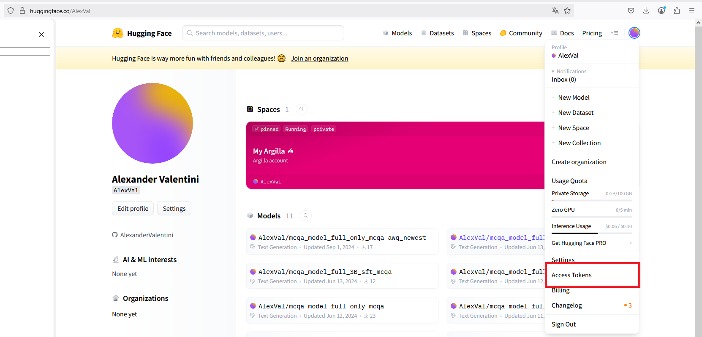
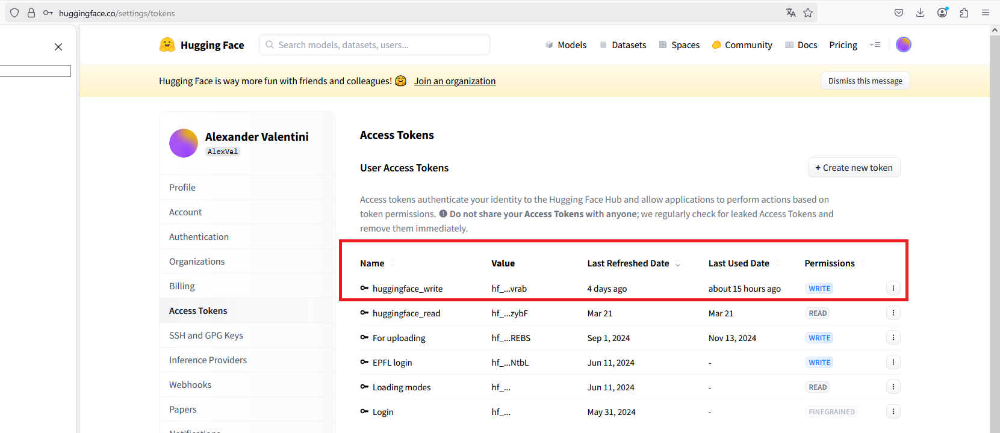
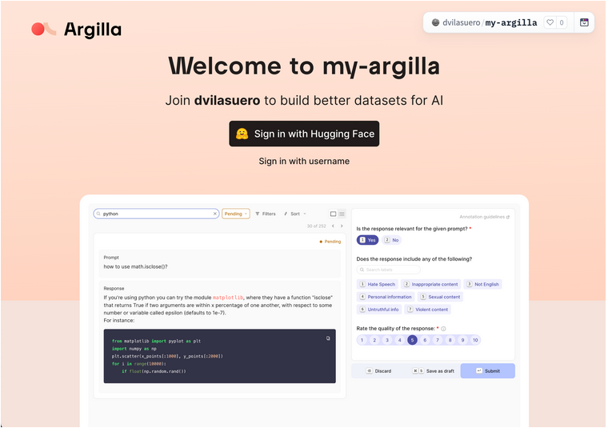
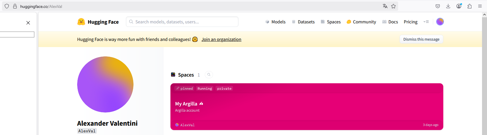
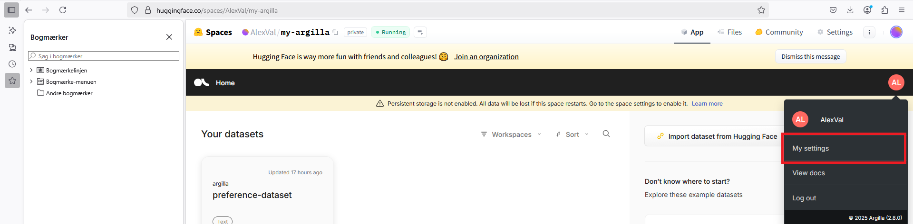
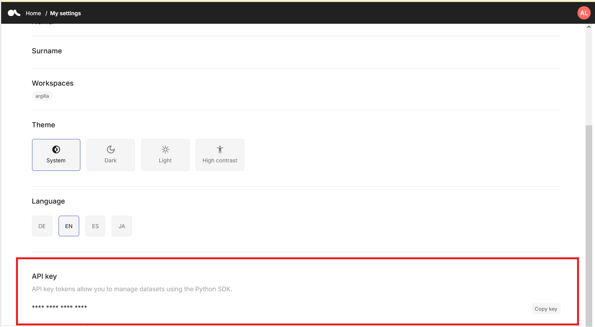

# Generating a synthetic preference dataset using LLM's

This is an adaptation of the tutorial from this link: 

https://distilabel.argilla.io/dev/sections/pipeline_samples/tutorials/generate_preference_dataset/#run-the-pipeline

The task is to use LLM's to synthetically generate a preference dataset. 

Some patches are necessary to make the code run. First I am using a PatchedInferenceEndpointsLLM, since theoriginal InferenceEndpointsLLM will try to access the paid Hugging Face Inference Endpoints API, which is not available in the free tier (as far as I understood). It will return None as the model. Also it will run a status check of the model and cause an error. 

Also I am using the dotenv library to load my HF api token stored in a .env file. 

To get the tutorial to work, first you will need an account at Huggingface and create a new access token (under "Access Tokens"):

Then you need to create an Argilla account and an Argilla space (a part of Huggingface). Here it is best to use this link:
https://docs.argilla.io/latest/getting_started/quickstart/

Click on Deploy on HF spaces - this will lead you to this link: 

https://huggingface.co/new-space?template=argilla/argilla-template-space&name=my-argilla

This will run a setup which will take some minutes. Next you will meet a login screen. You can login with huggingface or as a separate user. I chose "Sign in with username":

In the future you can find your Argilla space under your HF account:

Importantly you will need a Argilla API key as well. This is retrieved under your Argilla account:

At the bottom if you scroll down (you can copy it into your file):

Note that after a period of inactivity your Argilla space will enter sleep mode and cannot be accessed by your code. Then you need to go to your HF account and click in your space again to start it. You can check from the logs that it is running.

For some reason there is an error where the very last section of the code will run indefinitely (or at least they take a very long time). I couldn't find the error, but it might be something with the Argilla space and thee Huggingface server.  

It will probably not be possible to run at an exercise session, but is interesting as a proof of concept - although you would need another inference engine than the free Huggingface account since it is rather slow and rate limited.

